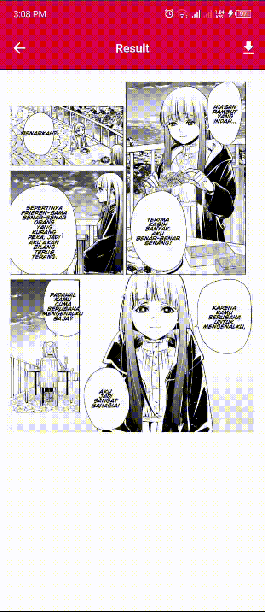
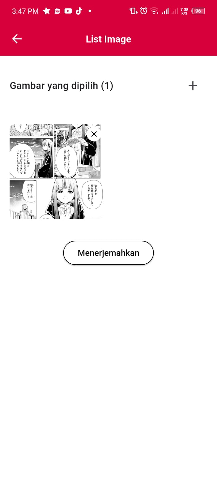
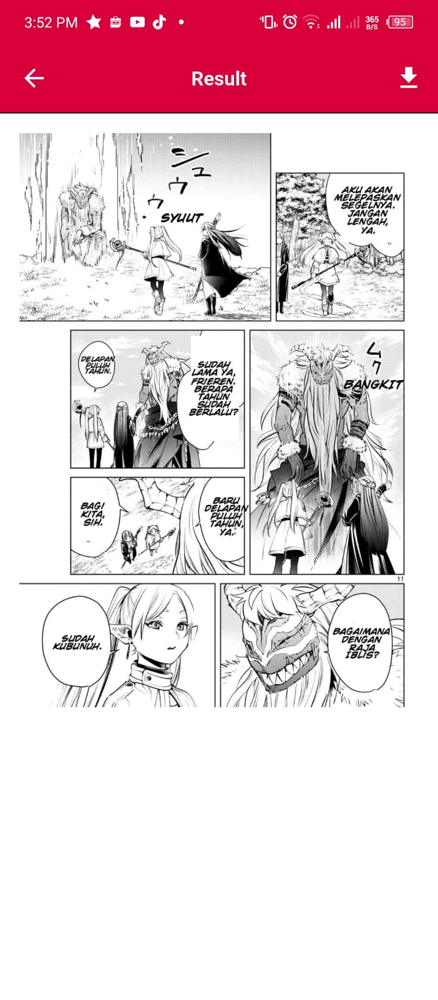
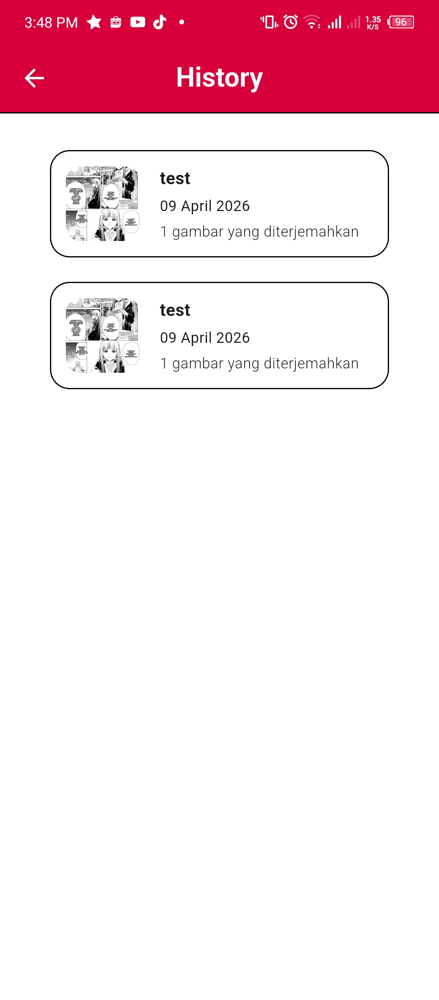
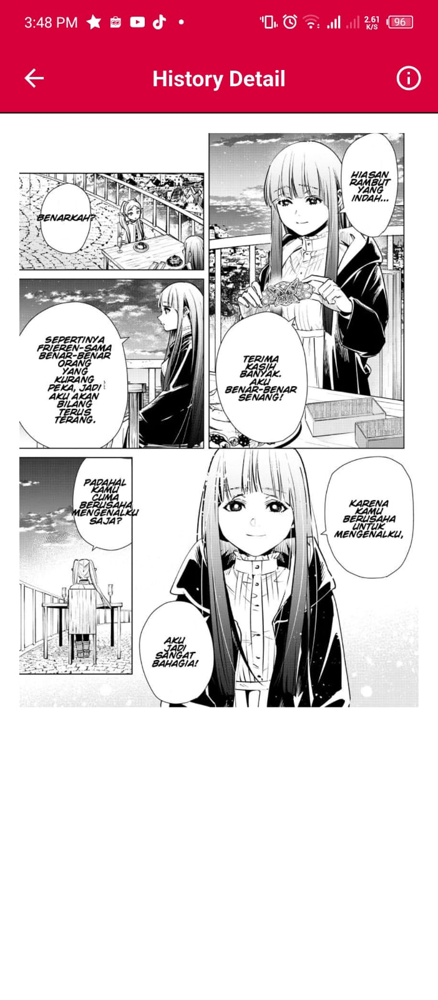

# 🎌 Manga Translator

A Flutter mobile application that translates Japanese manga pages into indonesian powered by a deep learning backend for object detection, OCR and automatic translation.

---

## 📱 Demo

<p align="center">
  
  &nbsp;&nbsp;&nbsp;
  
</p>

---

## 📸 Screenshots
| Upload Page | Translation Result | History | History Detail |
|:-----------:|:-----------------:|:-------:|:--------------:|
|  |  |  |  |

## ✨ Features

- 📤 **Upload manga page** — supports JPG,PNG and PDF formats
- 🔍 **Automatic detection** — detects panels, text balloons, and text effects via ML backend
- 🈯 **Japanese OCR** — extracts Japanese text from detected regions
- 🌐 **Auto translation** — translates extracted text to Indonesian
- 🖼️ **In-place rendering** — translated text rendered back onto the original manga page
- 📜 **Translation history** — stores and displays past translation results, saved locally on device

---

## 🛠️ Tech Stack

### Mobile (Frontend)
| Technology | Usage |
|---|---|
| Flutter | Cross-platform mobile framework |
| Dart | Programming language |
| BLoC| State management |
| Repository Pattern | Data layer abstraction |
| Hive | Local storage for translation history |

### Backend & ML (Private)
| Technology | Usage |
|---|---|
| Python | Core pipeline language |
| FastAPI | REST API framework |
| Faster R-CNN | Panel, text & text effect detection |
| MangaOCR | Japanese text recognition |
| GPT-4 | Japanese → Indonesian translation |
| OpenCV | Image preprocessing & inpainting |
| PyTorch | Deep learning framework |
---

## 🏗️ Architecture

This app follows a **BLoC + Repository pattern**, communicating with a private Python backend that handles all ML inference (object detection, OCR, and translation).

```
Flutter App
    │
    ├── Hive (local)      ← save & load translation history
    │
    │  HTTP (image upload + result)
    ▼
FastAPI Backend (private)
    │
    ├── /translate        ← receive image, return translated result
    └── /history          ← fetch translation history
         │
         └── ML Pipeline (private)
               └── Faster R-CNN · MangaOCR · GPT-4
```

---

## 🚀 Getting Started

### Prerequisites

- Flutter SDK `>=3.0.0`
- Android SDK `>=33` (API 33+ recommended, tested on API 36)
- The ML backend running locally (private repo)

### Installation

```bash
git clone https://github.com/yourusername/manga-translator-app.git
cd manga-translator-app
flutter pub get
```

Run the app:
```bash
flutter run
```

---

## 🗺️ Future Development

### Mobile Side
- [ ] Refactor to Clean Architecture (feature-based structure)
- [ ] Add dependency injection with `get_it`
- [ ] Improve error handling & loading states
- [ ] Add dark mode support
- [ ] Authentication and feed feature
- [ ] Add Firebase for Authentication and feed

### Backend & ML Side
- [ ] Migration from Faster R-CNN to YOLO for object detection
- [ ] More precision in Text Effect translation location
- [ ] Change from OpenCV to LaMa for natural inpainting
- [ ] Connect to deployed cloud backend
- [ ] Add more option for translation language

---

## 📄 License

This project is for portfolio and educational purposes.

---

## 🙋 Author

**Gladiuzz**
[GitHub](https://github.com/Gladiuzz) · [LinkedIn](https://www.linkedin.com/in/hasin-bashari-panansah/)